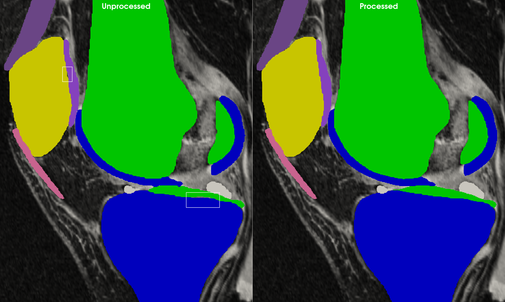
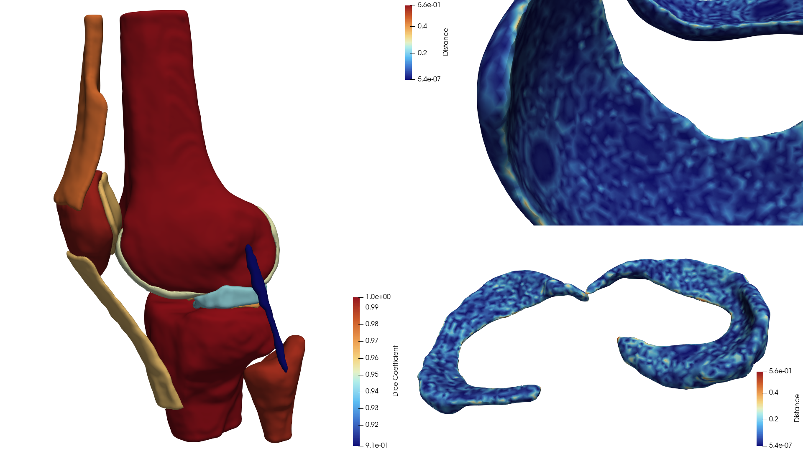
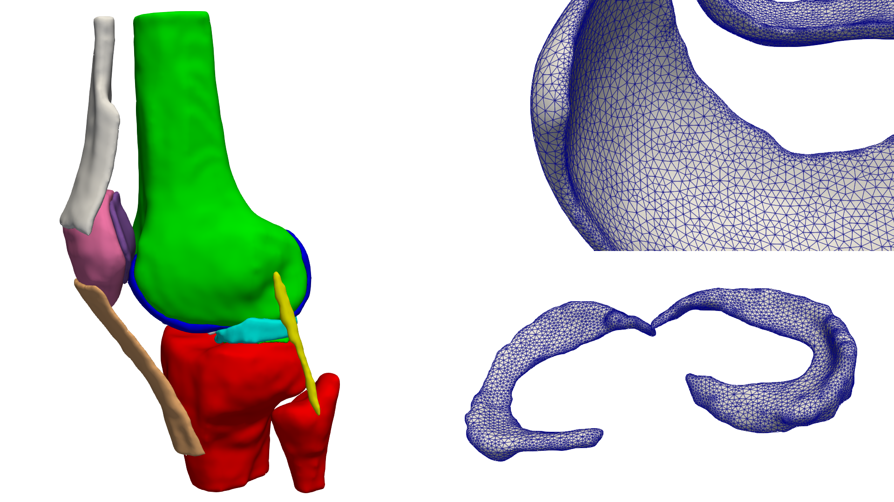
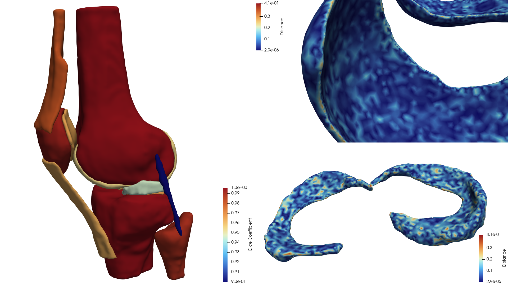

Examples
========

Prerequisites
--------------

We use the segmentation labels for OpenKnee(s) model 003 for these examples. You can download the
segmentation labels in NIfTI format from the `OpenKnee(s) datashare <https://simtk.org/plugins/datashare/userLogin.php?groupid=485&studyid=32&pathSelected=files/oks003/segmentation>`_.
The link should take you directly to ``OKS_models/oks003/segmentation`` after logging in.

- To download just the segmentation labels, right-click on the `segmentation` folder and select `Download`.
- SimTK will send a link to your registered email once the download is ready. You will need to follow this link to complete the download.

- Create a directory in the ``seg2mesh`` root directory called ``dat`` and extract the downloaded ZIP file to this directory.
- **Optionally**, remove the following files from the ``dat/oks003/segmentation`` directory as we will not be using them:

    - oks003_FMR-L_AGS.nii
    - oks003_FMR-M_AGS.nii
    - oks003_FMR-P_AGS.nii
    - oks003_PTR-L_AGS.nii
    - oks003_PTR-M_AGS.nii
    - oks003_PTR-S_AGS.nii
    - oks003_TBR-L_AGS.nii
    - oks003_TBR-M_AGS.nii
    - oks003_TBR-P_AGS.nii

You should now have a file structure in ``seg2mesh/dat`` that looks like this:

.. code-block:: text

    └── oks003
        └── segmentation
            ├── oks003_ACL_AGS.nii
            ├── oks003_FBB_AGS.nii
            ├── oks003_FMB_AGS.nii
            ├── oks003_FMC_AGS_03.nii
            ├── oks003_LCL_AGS.nii
            ├── oks003_MCL_AGS_02.nii
            ├── oks003_MNS-L_AGS_02.nii
            ├── oks003_MNS-M_AGS_02.nii
            ├── oks003_PCL_AGS.nii
            ├── oks003_PTB_AGS.nii
            ├── oks003_PTC_AGS.nii
            ├── oks003_PTL_AGS.nii
            ├── oks003_QAT_AGS.nii
            ├── oks003_TBB_AGS.nii
            ├── oks003_TBC-L_AGS.nii
            └── oks003_TBC-M_AGS.nii

Congratulations! You are ready to run the examples.

.. _segmentation-label-volume-processing-pipeline:

Segmentation Label Volume Processing Pipeline
---------------------------------------------

`seg2mesh` provides a pre-defined pipeline for processing segmentation label volumes.
This is configured with a :class:`seg2mesh.config.SegmentationPipeline` object. This object can be
defined in code or read from a JSON file.

Example: Segmentation labels as unique files
~~~~~~~~~~~~~~~~~~~~~~~~~~~~~~~~~~~~~~~~~~~~

.. literalinclude:: ../examples/process_oks_vols.json
    :language: json
    :caption: Example JSON configuration for the volume processing pipeline using unique label files

To execute the pipeline as a script, from the examples directory, run:

.. code-block:: bash

    uv run python -m seg2mesh.vol_pipeline process_oks_vol.json

Output files will be written to `../dat/examples/openknee` as specified by the `output_path` attribute.

Additional command-line arguments for `log_level` and `log_file` can be specified. See help
for `seg2mesh.vol_pipeline` by running:

.. code-block:: bash

    uv run python -m seg2mesh.vol_pipeline --help

.. note::
    The order of `source_files` matters. Later entries take precedence over earlier ones, if there
    is overclosure. We order the files as bones, then ligaments, then menisci, then cartilage. This
    ensures the thin cartilage structures take precedence, since changes in thickness will have very
    strong structural effects.

We can visualize the `unprocessed.seg.nrrd` and `processed.seg.nrrd` label images in supporting viewers.
The following images and videos were generated using ParaView. Figure 1 is a slice through animation of
the unprocessed and processed labels overlaid on the MRI (not provided in the prerequisite download).
Generally, there are only subtle changes between labels, which is desirable. We really just want to reduce
spurious (high frequency) features that will impact mesh creation later.

.. raw:: html

    <figure style="text-align: center;">
        <video controls width="100%">
            <source src="_static/overlay_slice_through.mp4" type="video/mp4">
            Your browser does not support the video tag.
        </video>
        <figcaption style="font-style: italic;">
            Figure 1: Slice through animation of the unprocessed and processed labels overlaid on the MRI.
        </figcaption>
    </figure>

Zooming in on a single slice, we can see the effects of `make_contiguous` in Figure 2.

    Figure 2: A slightly zoomed single slice comparison of the unprocessed and processed labels. Notice the
    effects of `make_contiguous` on the cartilage regions outlined in white boxes. Click for a full-size
    version.

Example: Segmentation labels in a single file
~~~~~~~~~~~~~~~~~~~~~~~~~~~~~~~~~~~~~~~~~~~~~

The previous example demonstrated how to process files where each label was a separate image. It also
built the Lookup Table (LUT) mapping each label "Short Name" to its integer value using the `source_files` list.
The "Short Name" were automatically defined as each source_file stem (i.e., the filename without extension).
When multiple labels are present in a single file, we do not have this option. Therefore, it is recommended
to supply the `lut` attribute in the config. Notice the single source_file was generated by the previous example,
so we already know the order of the integer labels. We also took the opportunity to shorten the names further.
Notice how these shorter names are used in the `open_list` and `make_contiguous` attributes.

.. note::
    If `lut` is not specified and there is a single item in `source_files`, the LUT will be automatically
    generated with keys defined as the str(label) where label is the integer values found in the image.

.. literalinclude:: ../examples/process_oks_multilabel_vol.json
    :language: json
    :caption: Example JSON configuration for volume processing pipeline using a single file containing multiple labels

Execute the pipeline as before with:

.. code-block:: bash

    uv run python -m seg2mesh.vol_pipeline process_oks_multilabel_vol.json

Output files will be written to `../dat/examples/openknee_multilabel` as specified by the `output_path` attribute.

Label Image to Mesh Pipeline
----------------------------

This pipeline first extracts each isocontour by its integer value. It then applies a sequence of optional
smoothing, remeshing, and error calculation operations configured by the :class:`seg2mesh.config.SurfaceMeshPipeline` class. Specifically, these are as follows:

- Taubin smoothing: defined by `taubin_smoothing_factor1` and `taubin_iterations1` options. Turn off smoothing by setting `taubin_iterations1 <= 0`.
- Remeshing: applied based on provided `remesh_options`. If None, no remeshing is performed. If `remesh_options`
  is :class:`seg2mesh.config.AcvdOptions`, the Approximate Centroidal Voronoi Diagram (ACVD) algorithm is used to remesh the mesh,
  otherwise if it is :class:`seg2mesh.config.MmgOptions`, the `mmg3d` remeshing library is used. Consult the class
  documentations for more details.
- Taubin smoothing: defined by `taubin_smoothing_factor2` and `taubin_iterations2` options. Turn off smoothing by setting `taubin_iterations2 <= 0`.
- Error metric calculation

  - If `calculate_distance_metrics` is `True`, Hausdorff, Mean Symmetric Surface, and Root Mean Square Distance metrics are calculated.
  - If `calculate_classification_metrics` is `True`, Dice Coefficient, Intersection over Union, and Accuracy metrics are calculated.
  - Metrics are saved to disk as CSV and also appended to the final processed polydata as FieldData.

.. note::
   If `calculate_classification_metrics` is `True`, one should also set `voxel_edge` to be similar to the voxel
   size of the label image. These metrics require a voxelization or the mesh, and it should be of similar or
   equal resolution as the original label volumes.

Example: Label image to mesh with uniform (ACVD) remeshing
~~~~~~~~~~~~~~~~~~~~~~~~~~~~~~~~~~~~~~~~~~~~~~~~~~~~~~~~~~

For this first mesh extraction and processing example, we use the ACVD remeshing algorithm to create a
mesh of nearly uniform edge length. After extracting the isocontours we first apply Taubin smoothing,
then we remesh to a 0.75mm edge length using ACVD, then apply another soft Taubin smoothing operation.
The JSON configuration for this example is shown below.

.. literalinclude:: ../examples/smesh_oks_acvd.json
    :language: json
    :caption: Example JSON configuration for extracting isocontour from a label intensity image and processing the resulting mesh.

Execute the pipeline with:

.. code-block:: bash

    uv run python -m seg2mesh.smesh_pipeline smesh_oks_acvd.json

We visualize the resulting meshes using the configured pipeline in Figure 3 and 4.

    Figure 3: The triangular meshes generated by the pipeline for the specified configuration.
    Zoomed in views of the femoral cartilage (top-right) and menisci (bottom-right)
    with mesh edges visible illustrate the uniform remeshing with ACVD.

    Figure 3: Error metrics are stored when saved in VTP format. Aggregate measures like Dice Coefficient (left)
    are stored as FieldData. Per-vertex data like Distance (shortest distance from processed to unprocessed
    mesh) can be visualized as shown for the femoral cartilage (top-right) and menisci (bottom-right).
    Note the Distances are highest in areas of high curvature, like the thin cartilage edge, largely
    due to the use of uniform remeshing.

Example: Label image to mesh with adaptive (mmg3d) remeshing
~~~~~~~~~~~~~~~~~~~~~~~~~~~~~~~~~~~~~~~~~~~~~~~~~~~~~~~~~~~~

For this mesh extraction and processing example, we instead use the MMG3D remeshing algorithm to create a
mesh that is adapted to the local curvature of the initial mesh. This is controlled by the defining `remesh_options` as
a :class:`seg2mesh.config.MmgOptions` object. We clamp the curvature determined local edge length to `hmin <= x <= hmax`.
After extracting the isocontours we first apply Taubin smoothing, then we adaptively remesh, then apply another soft
Taubin smoothing operation. The JSON configuration for this example is shown below.

.. literalinclude:: ../examples/smesh_oks_mmg.json
    :language: json
    :caption: Example JSON configuration for extracting isocontour from a label intensity image and processing the resulting mesh.

Execute the pipeline with:

.. code-block:: bash

    uv run python -m seg2mesh.smesh_pipeline smesh_oks_mmg.json

We visualize the resulting meshes using the configured pipeline in Figure 5 and 6.

    Figure 5: The triangular meshes generated by the pipeline for the specified configuration.
    Zoomed in views of the femoral cartilage (top-right) and menisci (bottom-right)
    with mesh edges visible illustrate the adaptive remeshing with MMG3D.

    Figure 6: Error metrics are stored when saved in VTP format. Aggregate measures like Dice Coefficient (left)
    are stored as FieldData. Per-vertex data like Distance (shortest distance from processed to unprocessed
    mesh) can be visualized as shown for the femoral cartilage (top-right) and menisci (bottom-right).
    Distances are still highest in areas of high curvature, but due to using adaptive remeshing, these
    are less than in the ACVD example.
